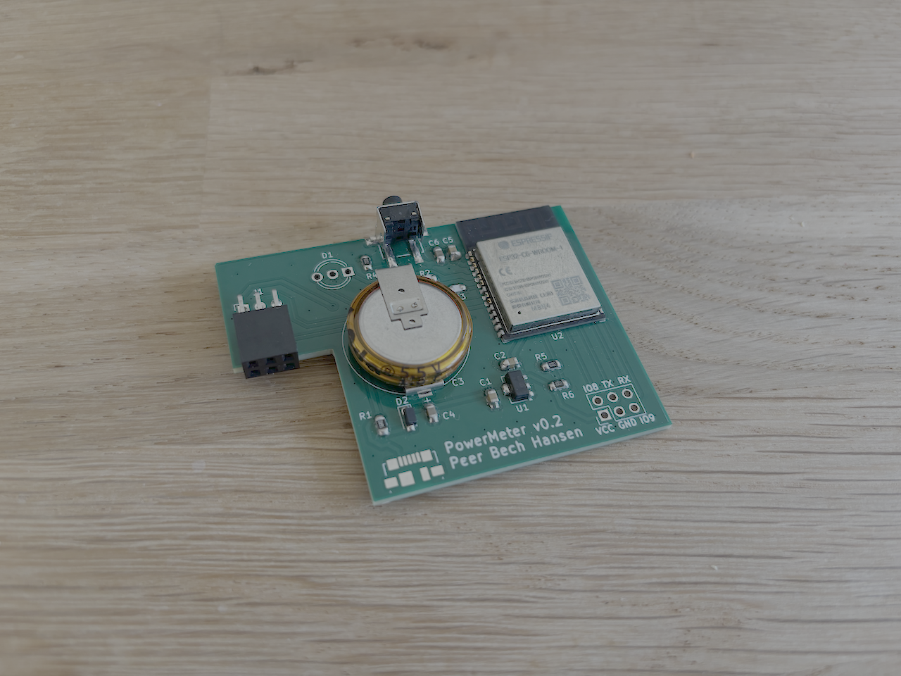
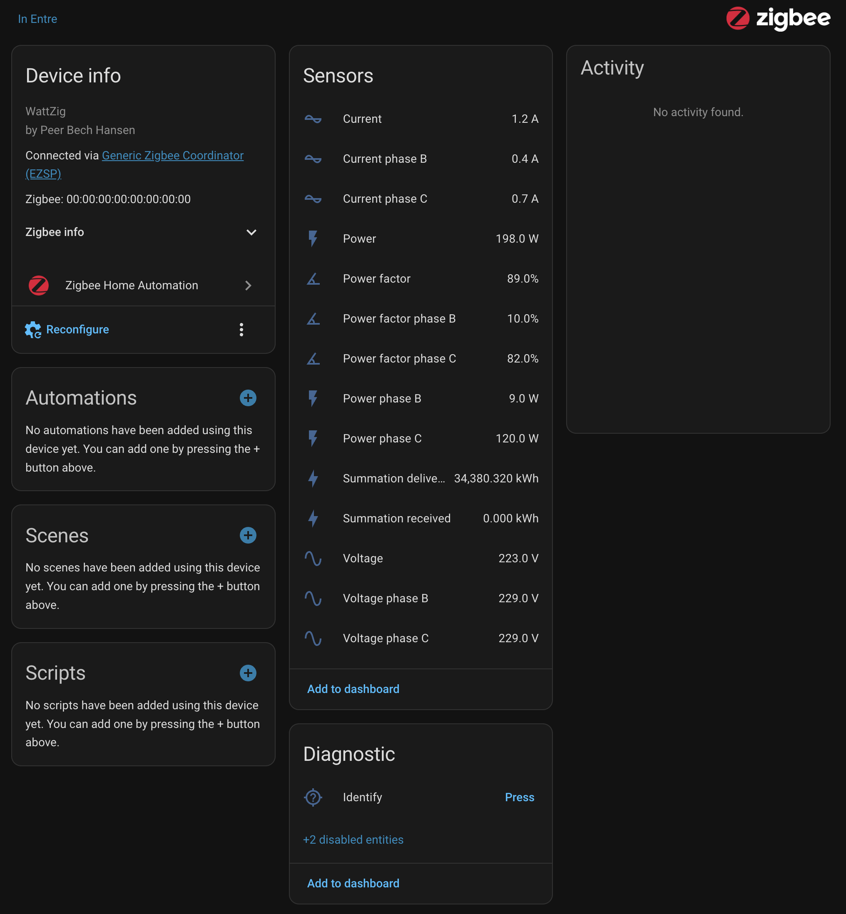

# WattZig - The Open Zigbee Power Meter

[](https://github.com/bechhansen/wattzig/actions/workflows/esp32-build.yml)
[](https://github.com/bechhansen/wattzig/releases/latest)
[](LICENSE)
[](https://github.com/espressif/esp-idf)
[](https://www.espressif.com/en/products/socs/esp32-c6)
[](https://www.home-assistant.io/integrations/zha/)
[](https://www.home-assistant.io/)

A Zigbee-based smart power meter reader for ESP32C6 that reads 3-phase electrical data via DLMS protocol and reports measurements to Zigbee hubs (Home Assistant, etc.).



## Overview

WattZig reads meter data via DLMS protocol over UART and reports 3-phase electrical measurements (voltage, current, active/reactive power, power factor, energy counters) through ZHA-compliant Zigbee clusters.



*The WattZig device reporting real-time electrical measurements to Home Assistant via Zigbee. All three phases show voltage (~228-230V), current (0.0-0.7A), power (9.0-130W), and power factor (11%-86%). The device also reports total energy consumption (34,351.77 kWh delivered) and can be integrated into automations and dashboards.*

## Features

- **3-Phase Metering**: Voltage, current, active/reactive power, power factor (phases A, B, C)
- **Energy Tracking**: Import/export energy counters with reporting
- **Zigbee ZHA**: Home Assistant integration via standard clusters
- **DLMS Parser**: State machine-based protocol handler at 2400 baud
- **Low Power**: FreeRTOS task design with Zigbee sleep support
- **Auto-Commissioning**: Network steering on first start
- **Status LEDs**: Green (data transmission), Red (commissioning)
- **Button Controls**: Long press (4s) = factory reset, double-click = restart

## Hardware Requirements

- **Microcontroller**: ESP32C6 (required for Zigbee)
- **ESP-IDF**: v5.5.2 (exact version)
- **Power Supply**: ≥4.5V input, MCP1700-3302E 3.3V regulator, 470µF–1000µF bulk capacitor (parallel to regulator)
- **UART1** (DLMS): TX=GPIO0, RX=GPIO1, 2400 baud, 8 bits, no parity
- **Peripherals**: GPIO5=Red LED, GPIO6=Green LED, GPIO4=Button

See [HARDWARE.md](HARDWARE.md) for complete Bill of Materials, schematics, and assembly instructions.

## Software Requirements

- **ESP-IDF v5.5.2**: `git clone -b v5.5.2 https://github.com/espressif/esp-idf.git && ./install.sh && source export.sh`
- **Dependencies** (auto-installed):
  - `espressif/esp-zigbee-lib` (~1.6.8)
  - `espressif/esp-zboss-lib` (~1.6.4)
  - `espressif/button` (2.4.1)

## Installation & Setup

1. **Clone and configure:**
   ```bash
   git clone <repo-url>
   cd wattzig/Software
   idf.py menuconfig
   ```

2. **Required menuconfig settings:**
   - `Component Config > Zigbee > Enable Zigbee Stack`
   - `Component Config > Zigbee > Device Type > End Device`
   - `Component Config > Power Management > Enable Power Management`

3. **Build and flash:**
   ```bash
   idf.py build
   idf.py -p /dev/ttyUSB0 -b 115200 flash
   idf.py -p /dev/ttyUSB0 monitor  # Exit: Ctrl+T then X
   ```

   See [FLASHING.md](FLASHING.md) for detailed hardware setup, boot mode configuration, and troubleshooting.

## Usage

**First Start:**
1. Device boots and performs factory reset
2. LED blinks (commissioning mode)
3. Device joins nearest Zigbee network via network steering
4. LED on briefly, then off
5. UART task starts reading meter data

**Normal Operation:**
- Device loads saved network config
- UART reads DLMS frames from meter
- Parsed data updates Zigbee cluster attributes
- Energy counters trigger ZCL reports

**Zigbee Endpoint 10:**
- Basic Cluster (0x0000): Device info
- Identify Cluster (0x0003): Identification
- Electrical Measurement (0x0B04): Voltage, current, power, power factor (all phases)
- Metering Cluster (0x0702): Energy delivered/received


## Configuration

Edit [Software/main/main.h](Software/main/main.h) for:
```c
#define ENDPOINT_ID 10                    // Zigbee endpoint
#define UART_NUM UART_NUM_1               // UART peripheral
#define UART_BAUD_RATE 2400               // Meter communication speed
#define LED_PIN 5                         // Red status LED
#define LED_PIN2 6                        // Green status LED
#define ED_AGING_TIMEOUT ESP_ZB_ED_AGING_TIMEOUT_64MIN
#define ED_KEEP_ALIVE 3000                // Keep-alive interval (ms)
```

## Debugging

### Enable Debug Logging
```c
// In app_main(), modify:
esp_log_level_set("Parser", ESP_LOG_DEBUG);  // Enable DLMS parser logs
esp_log_level_set("*", ESP_LOG_INFO);         // General logs
```

## References

- [ESP-IDF v5.5.2 Documentation](https://docs.espressif.com/projects/esp-idf/en/v5.5.2/)
- [Zigbee Cluster Library (ZCL)](https://zigbeealliance.org/)
- [Zigbee Cluster Library Specification](https://zigbeealliance.org/wp-content/uploads/2019/12/07-5123-06-zigbee-cluster-library-specification.pdf)
- [DLMS/COSEM Protocol](https://www.dlms.com/)
- [Home Assistant ZHA Integration](https://www.home-assistant.io/integrations/zha/)

## License

This project is licensed under the **GNU General Public License v3 (GPLv3)**.

You are free to use, modify, and distribute this software under the following conditions:
- Any derivative works must also be released under GPLv3
- You must provide access to the source code
- You must include this license and attribution
- You cannot create proprietary closed-source versions

See [LICENSE](LICENSE) for full details.

**GPLv3 ensures that improvements and modifications remain open source for the entire community.**

